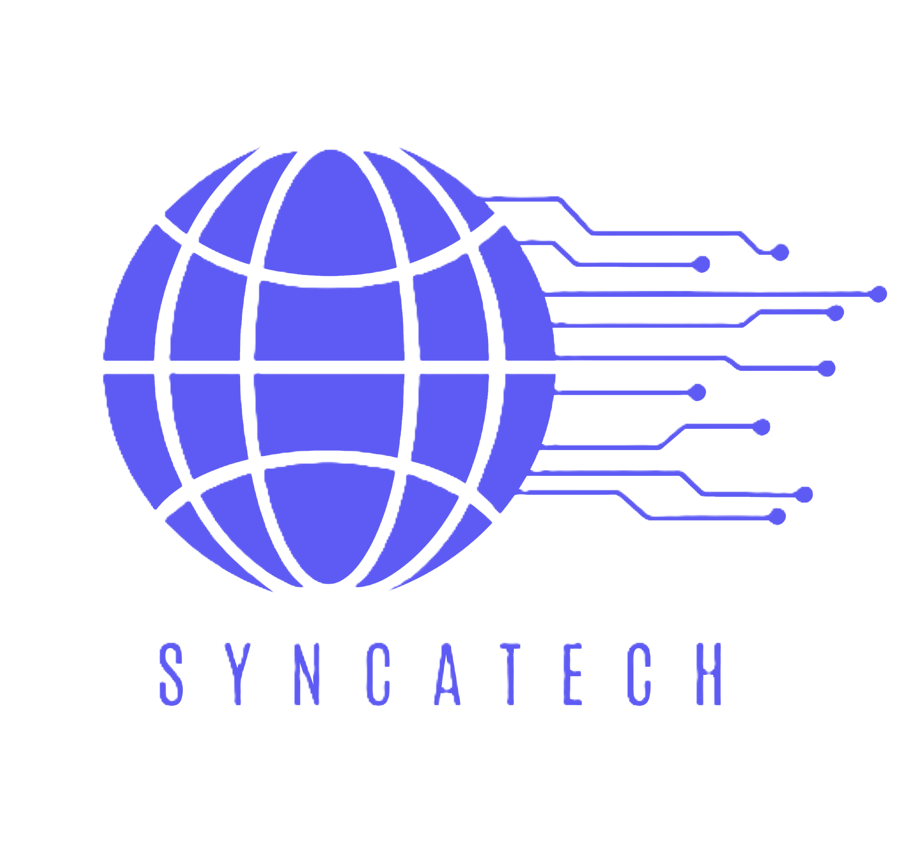

<a name="readme-top"></a>

<!--
HOW TO USE:
This is an example of how you may give instructions on setting up your project locally.

Modify this file to match your project and remove sections that don't apply.

REQUIRED SECTIONS:
- Table of Contents
- About the Project
  - Built With
  - Live Demo
- Getting Started
- Authors
- Future Features
- Contributing
- Show your support
- Acknowledgements
- License

OPTIONAL SECTIONS:
- FAQ

After you're finished please remove all the comments and instructions!
-->

<div align="center">
  <!-- You are encouraged to replace this logo with your own! Otherwise you can also remove it. -->
  
  <br/>

  <h3><b>ProjSync - Aplikacija za upravljanje projektima</b></h3>

</div>

<!-- TABLE OF CONTENTS -->

# 📗 Sadržaj

- [📖 O projektu](#about-project)
  - [🛠 Built With](#built-with)
    - [Tech Stack](#tech-stack)
    - [Key Features](#key-features)
  - [🚀 Live Demo](#live-demo)
- [💻 Getting Started](#getting-started)
  - [Setup](#setup)
  - [Prerequisites](#prerequisites)
  - [Usage](#usage)
  - [Run tests](#run-tests)
  - [Deployment](#deployment)
- [👥 Authors](#authors)
- [🙏 Acknowledgements](#acknowledgements)

<!-- PROJECT DESCRIPTION -->

# 📖 ProjSync <a name="about-project"></a>

Aplikacija ProjSync je razvijena kao deo projekta za potrebe predmeta Uvod u softversko inženjerstvo. Osnovni cilj projekta je pružiti efikasan alat za upravljanje projektima, koji bi korisnicima omogućio da organizuju, prate i koordiniraju različite zadatke, resurse i aktivnosti u okviru svojih projekata.

## 🛠 Razvoj <a name="built-with"></a>

### Tech Stack <a name="tech-stack"></a>

Što se tehnologija tiče, navedena aplikacija je razvijena korišćenjem jedne od savremenih web tehnologija - Angular kao frontend, dok je za potrebe serverske strane korišćen .NET framework.

<details>
  <summary>Client</summary>
  <ul>
    <li><a href="https://angular.io/">Angular</a></li>
  </ul>
</details>

<details>
  <summary>Server</summary>
  <ul>
    <li><a href="https://dotnet.microsoft.com/en-us/">.NET</a></li>
  </ul>
</details>

<details>
<summary>Database</summary>
  <ul>
    <li><a href="https://www.mysql.com/">MySQL</a></li>
  </ul>
</details>

<!-- Features -->

### Key Features <a name="key-features"></a>

- **Upravljanje podacima o korisnicima i njihovim ulogama**
- **Kreiranje i upravljanje projektima**
- **Upravljanje aktivnostima na projektu**
- **Različiti načinini vizualizacije aktivnosti**
- **Filtriranja podataka**

<p align="right">(<a href="#readme-top">back to top</a>)</p>

<!-- LIVE DEMO -->

## 🚀 Live Demo <a name="live-demo"></a>

- [Live Demo Link](https://google.com) - biće priložen prilikom migracije na server

<p align="right">(<a href="#readme-top">back to top</a>)</p>

<!-- GETTING STARTED -->

## 💻 Getting Started <a name="getting-started"></a>

### Prerequisites

Za potrebe pokretanja aplikacije neophodno je imati instalirano:
* Node.js - moze se preuzeti putem sledeceg [linka](https://nodejs.org/en/download)
* Angular CLI - instalirati komandom
``` npm install -g @angular/cli ```
* .NET - moze se preuzeti putem sledeceg [linka](https://dotnet.microsoft.com/en-us/download)

<!--
Example command:

```sh
 gem install rails
```
 -->

### Setup

Aplikacija se može klonirati u željeni direktorijum komanom:

```sh
  cd ./direktorijum
  git clone http://gitlab.pmf.kg.ac.rs/si2024/syncatech.git
```

Takodje, moguće je preuzeti i .zip verziju koju je potrebno otpakovati u određeni direktorijum takođe.

### Usage

To run the project, execute the following command:

<!--
Example command:

```sh
  rails server
```
--->

### Run tests

To run tests, run the following command:

<!--
Example command:

```sh
  bin/rails test test/models/article_test.rb
```
--->

### Deployment

You can deploy this project using:

<!--
Example:

```sh

```
 -->

<p align="right">(<a href="#readme-top">back to top</a>)</p>

<!-- AUTHORS -->

## 👥 Authors <a name="authors"></a>

👤 **Radovan Drašković**

- GitHub: [@Drashko73](https://github.com/Drashko73)
- LinkedIn: [LinkedIn](https://linkedin.com/in/radovan-draskovic)

👤 **Mihajlo Nikolić**

- GitHub: [@githubhandle](https://github.com/githubhandle)
- Twitter: [@twitterhandle](https://twitter.com/twitterhandle)
- LinkedIn: [LinkedIn](https://linkedin.com/in/linkedinhandle)

👤 **Vladimir Geroski**

- GitHub: [@githubhandle](https://github.com/githubhandle)
- Twitter: [@twitterhandle](https://twitter.com/twitterhandle)
- LinkedIn: [LinkedIn](https://linkedin.com/in/linkedinhandle)

👤 **Luka Gvozdenović**

- GitHub: [@githubhandle](https://github.com/githubhandle)
- Twitter: [@twitterhandle](https://twitter.com/twitterhandle)
- LinkedIn: [LinkedIn](https://linkedin.com/in/linkedinhandle)

👤 **Milan Bajić**

- GitHub: [@githubhandle](https://github.com/githubhandle)
- Twitter: [@twitterhandle](https://twitter.com/twitterhandle)
- LinkedIn: [LinkedIn](https://linkedin.com/in/linkedinhandle)

👤 **Dora Dimitrijević**

- GitHub: [@githubhandle](https://github.com/githubhandle)
- Twitter: [@twitterhandle](https://twitter.com/twitterhandle)
- LinkedIn: [LinkedIn](https://linkedin.com/in/linkedinhandle)

<p align="right">(<a href="#readme-top">back to top</a>)</p>


<!-- ACKNOWLEDGEMENTS -->

## 🙏 Acknowledgments <a name="acknowledgements"></a>

> Give credit to everyone who inspired your codebase.

I would like to thank...

<p align="right">(<a href="#readme-top">back to top</a>)</p>
