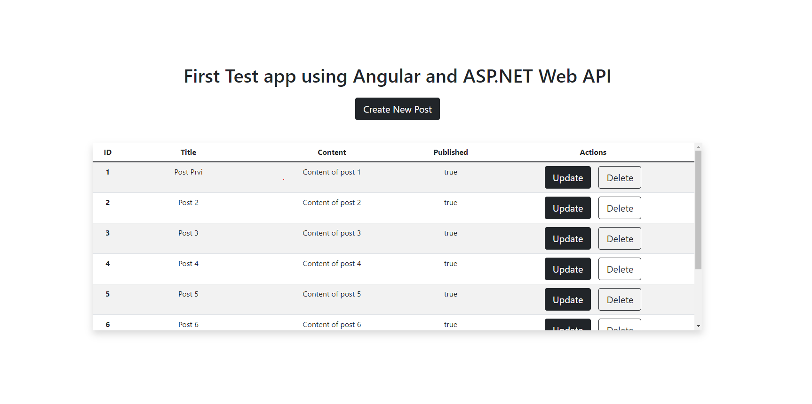
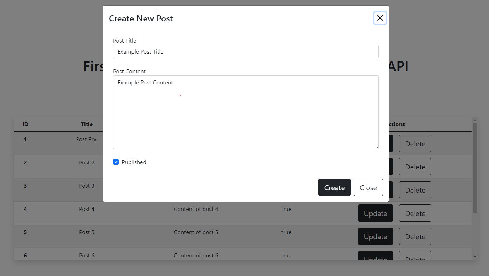
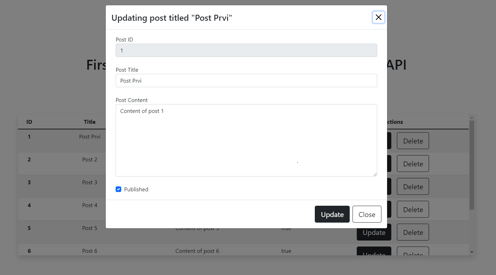
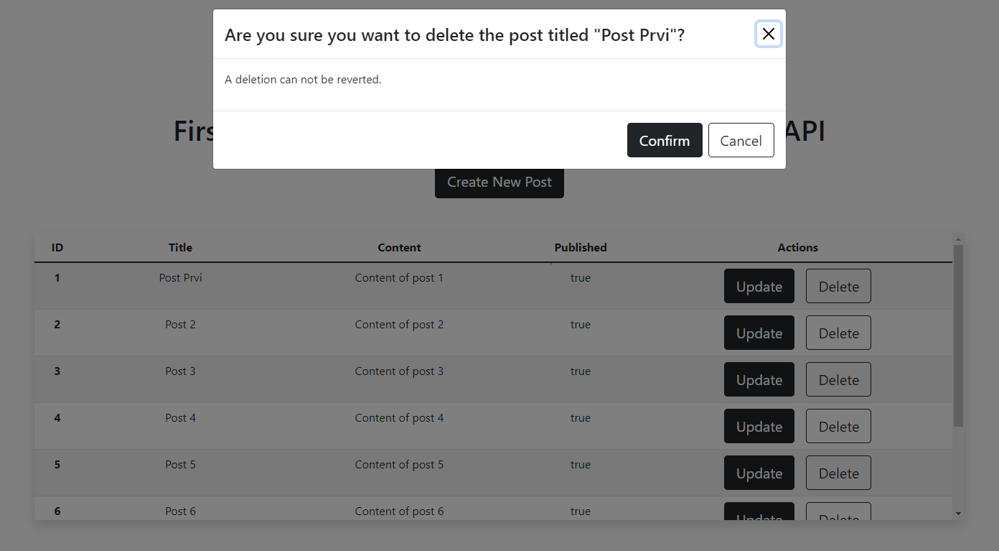

# Post Viewer

Kreirana manja aplikacija omogucava kreiranje prikaz postova, kreiranje novih postova, brisanje postova i azuriranje postojecih postova.

Front: ```Angular```  
Back: ```ASP.NET Web API```  
Baza podataka: ```SQLite```

### Pokretanje aplikacije

1. Preuzeti odgovarajuci kod aplikacije ili klonirati repozitorijum
2. Preusmeriti se u odgovarajuci backend direktorijum: 
    ```
    syncatech/sandbox/pilot_projects/radovan/AngularNETApp/Server
    ```
    i pokrenuti backend server:
    ```
    dotnet run
    ```

3. Preusmeriti se u odgovarajuci frontend direktorijum:
    ```
    syncatech/sandbox/pilot_projects/radovan/AngularNETApp/Client
    ```
    Instalirati potrebne module:
    ```
    npm install
    ```
    Pokrenuti server:
    ```
    ng serve [-o]
    ```

Korisceni/Potrebni NuGet paketi:
*   Microsoft.EntityFrameworkCore
*   Microsoft.EntityFrameworkCore.Design
*   Microsoft.EntityFrameworkCore.Sqlite

Inicijalni izgled aplikacije:


Dodavanje novog posta pop-up:


Izmena posta pop-up:


Brisanje posta pop-up:
